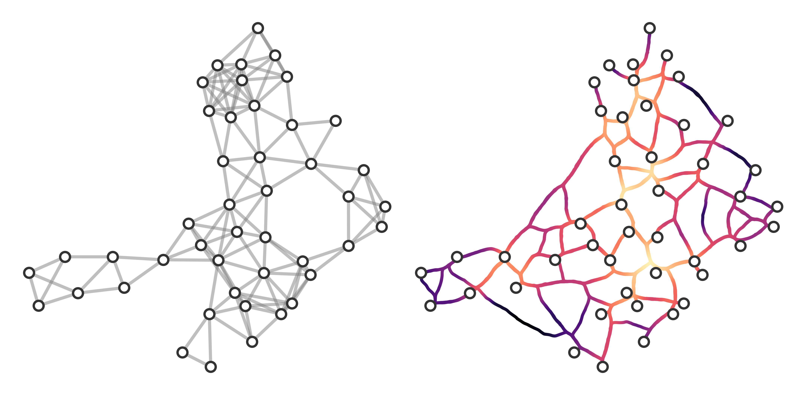

# networkx-edge-bundling
hacky way to bundle some edges in networkx and matplotlib.

This is another one for the "things you'll probably never need and are not nice enough to *actually* use..." list.

That said, this leans quite heavily on the [datashader library](https://datashader.org/topics/index.html), which I found to be wonderful.

